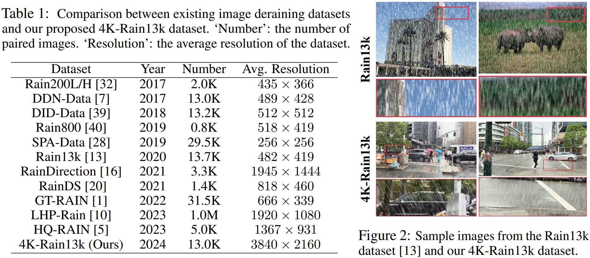

## 📖 Towards Ultra-High-Definition Image Deraining: A Benchmark and An Efficient Method
> Hongming Chen, Xiang Chen, Chen Wu, Zhuoran Zheng, Jinshan Pan, and Xianping Fu <br>

---
### 4K-Rain13k Dataset

(The datasets are hosted on both Google Drive and BaiduPan)
| Download Link | Description | 
|:-----: |:-----: |
| Google Drive / [Baidu Netdisk](https://pan.baidu.com/s/1Kao-OjWNlgg2Jl0Jtl7e5Q?pwd=spfi) | A total of 12,500 pairs for training and 500 pairs for testing. |

### Evaluation
The PSNR, SSIM and MSE results are computed by using this [Python Code](https://github.com/cschenxiang/UDR-Mixer/tree/main/metrics).

### Visual Results
| Method | Download Link | 
|:-----: |:-----: |
| LPNet | Google Drive / Baidu Netdisk |
| JORDER-E | Google Drive / Baidu Netdisk |
| RCDNet | Google Drive / Baidu Netdisk |
| SPDNet | Google Drive / Baidu Netdisk |
| IDT | Google Drive / Baidu Netdisk |
| Restormer | Google Drive / Baidu Netdisk |
| DRSformer | Google Drive / Baidu Netdisk |
| UDR-S2Former | Google Drive / Baidu Netdisk |
| UDR-Mixer | Google Drive / Baidu Netdisk |

### Citation
If you find this project useful in your research, please consider citing:
```
@article{chen2024towards,
  title={Towards Ultra-High-Definition Image Deraining: A Benchmark and An Efficient Method},
  author={Chen, Hongming and Chen, Xiang and Wu, Chen and Zheng, Zhuoran and Pan, Jinshan and Fu, Xianping},
  journal={arXiv preprint arXiv:2405.17074},
  year={2024}
}
```

### Disclaimer
Please only use the dataset for research purposes.

### Contact
If you have any questions, please feel free to reach me out at chenxiang@njust.edu.cn


